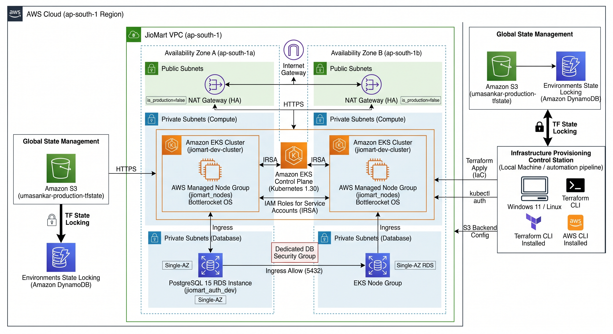

# Multi-Environment AWS Infrastructure Architecture via Modular Terraform

## 🏗️ Architecture Design Overview




This repository contains production-grade Infrastructure as Code (IaC) to provision a secure, highly available, and scalable cloud platform on AWS. The project is structured using a multi-environment layout (`development`, `staging`, `production`) powered by custom, reusable local modules to enforce strict architectural compliance and enterprise governance.

The infrastructure footprint provisions:
- **Custom VPC Network:** A highly available networking architecture spanning multiple Availability Zones (AZs) with isolated Public Subnets (hosting NAT Gateways for outbound internet access) and Private Subnets to secure compute and database nodes.
- **Amazon EKS Cluster:** A production-ready Kubernetes control plane mapped to IAM Roles for Service Accounts (IRSA) and backed by AWS Managed Node Groups running in private subnets.
- **Amazon RDS PostgreSQL/MySQL Tiers:** Dedicated private database instances completely shielded behind AWS Security Groups, configured to accept ingress traffic *strictly* from the EKS worker nodes.
- **Global State Management:** A secure, remote state backend topology using Amazon S3 with AES-256 server-side encryption alongside an Amazon DynamoDB state-locking schema to prevent concurrent execution conflicts in team environments.

---

## 📁 Repository Directory Structure

```text
.
├── README.md               # Main architectural documentation
├── environments/           # Environment-specific root configurations
│   ├── development/        # Isolated dev sandbox environment
│   ├── staging/            # Staging/UAT pre-production environment
│   └── production/         # Highly available production cluster
├── global/
│   └── s3-backend/         # Bootstrap configuration to provision S3 & DynamoDB for state
├── modules/                # Custom, reusable infrastructure resource blocks
│   ├── vpc/                # Subnets, Route Tables, IGW, and NAT Gateways
│   ├── eks/                # EKS Control Plane, Node Groups, and IAM Roles
│   └── rds/                # Database Subnet Groups, Security Groups, and RDS Instances
└── scripts/                # Helper automation or bootstrapping scripts

```

---

## 🛠️ Prerequisites

Before executing the blueprints in this repository, ensure your local Windows 11 / Linux control station has:

* **Terraform CLI** (`>= 1.5.0`)
* **AWS CLI** configured with valid IAM Administrative credentials
* **kubectl** matching the deployed EKS Kubernetes version

---

## 🚀 Execution & Deployment Workflow

### Step 1: Bootstrap the Global Remote Backend

Navigate to the global directory to provision the S3 Bucket and DynamoDB table that will host and lock your infrastructure state files:

```bash
cd global/s3-backend
terraform init
terraform apply -auto-approve

```

### Step 2: Initialize and Deploy an Environment

Choose your target workspace environment (e.g., `production`), verify your backend parameters inside `backend.tf`, and initialize the modules:

```bash
cd ../../environments/production
terraform init

```

Generate an execution plan to verify resource additions and securely apply the infrastructure changes:

```bash
terraform plan -out=tfplan.binary
terraform apply tfplan.binary

```

### Step 3: Access the Kubernetes Cluster

Once the EKS module finishes provisioning, capture the cluster context to interact with your worker nodes natively via `kubectl`:

```bash
aws eks update-kubeconfig --region <your-aws-region> --name <your-cluster-name>
kubectl get nodes

```

---

## 🧹 Cost Optimization & Infrastructure Cleanup

To tear down the environments cleanly and prevent unnecessary AWS cloud spend during project demonstrations, execute the destruction plans in reverse order:

```bash
# Tear down the active environment
cd environments/production
terraform destroy -auto-approve

# Tear down the backend state infrastructure (Only if completely resetting your account)
cd ../../global/s3-backend
terraform destroy -auto-approve

```

```


* **Tech Tags (Topics):** `terraform`, `aws-eks`, `aws-vpc`, `aws-rds`, `infrastructure-as-code`, `devops`, `multi-environment`, `platform-engineering`
