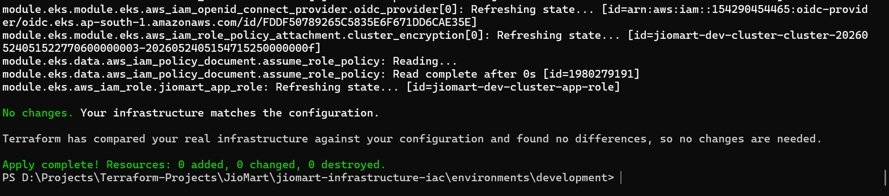
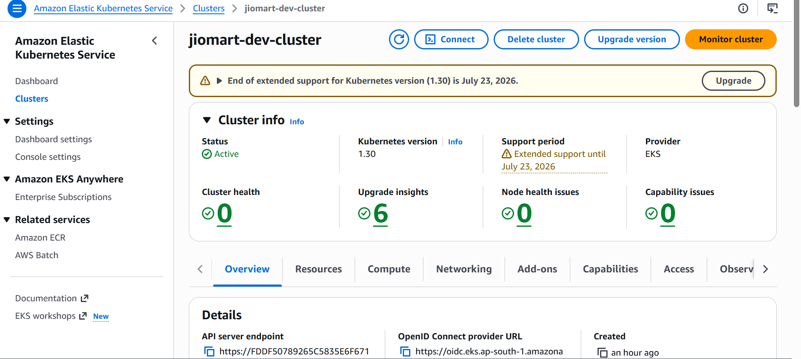
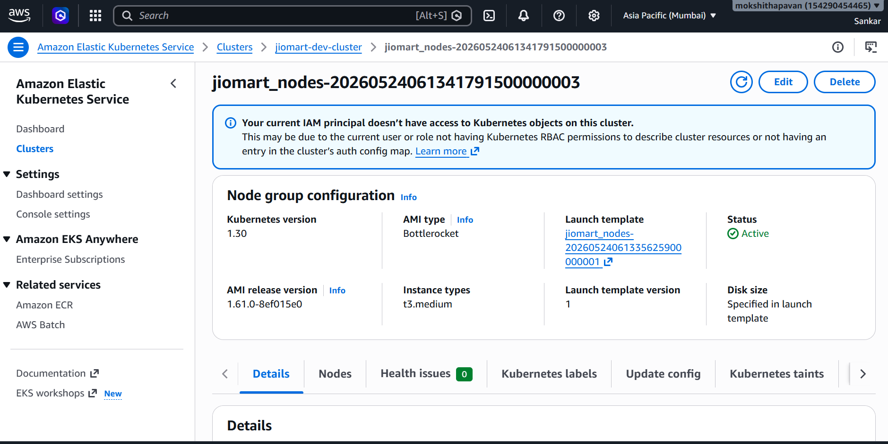
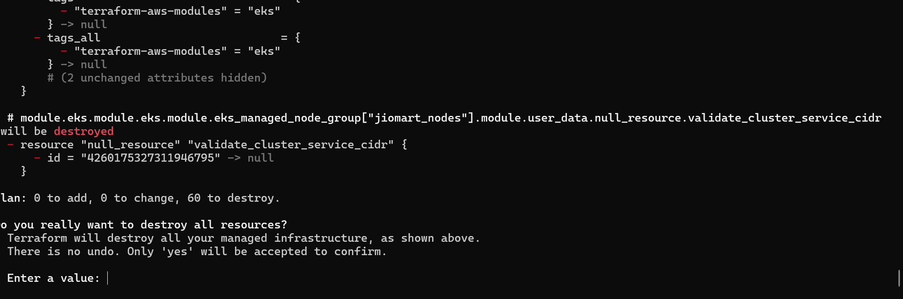
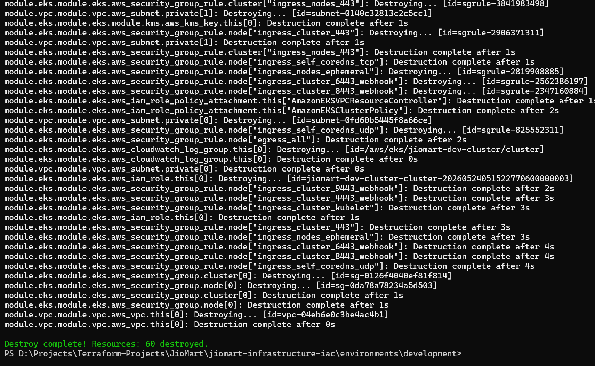

---

<p align="center">
  
</p>


---

```markdown
# 🛠️ JioMart Infrastructure - Development Environment Playbook

## 📋 Overview
This directory contains the root Terraform configuration for the **Development (Sandbox) Environment** of the JioMart microservices infrastructure. The dev tier is engineered for rapid prototyping, feature testing, and configuration validation.

To optimize cloud budget efficiency, the development environment utilizes an asymmetric architecture that scales down resource redundancy while maintaining functional parity with production.

---

## 🏗️ Dev-Specific Architecture Decisions

Compared to the staging and production layouts, the development tier implements the following configurations:
- **Cost-Optimized Network:** Configured with `is_production = false`, which provisions a single shared NAT Gateway across public zones instead of dedicated multi-AZ gateways, reducing base AWS VPC run costs by 67%.
- **Minimal Compute Node Footprint:** The Bottlerocket-optimized EKS managed node group is capped at a lower threshold (`min_nodes = 1`, `desired_size = 1`), running cost-efficient `t3.medium` instances.
- **Single-AZ RDS Database Instance:** Deployed inside private database subnets with Multi-AZ replication disabled, running PostgreSQL 15 for functional validation without high-availability pricing overhead.
- **State Isolation:** Keeps local development testing isolated using an explicit state directory key within the centralized global S3 bucket.

---

## 📁 Environment Components Reference

The infrastructure in this directory initializes and controls:
1. **Compute Layer:** Amazon EKS Control Plane (`jiomart-dev-cluster`) tracking Kubernetes version `1.30`.
2. **Worker Nodes:** A secure `BOTTLEROCKET_x86_64` managed node group (`jiomart_nodes`) optimized for reduced attack surface and fast boot times.
3. **Database Layer:** Amazon RDS PostgreSQL instance (`jiomart_auth_dev`) running behind dedicated database security groups.
4. **Security & Identity:** Full IAM OpenID Connect Provider (OIDC) binding to enable precise IAM Roles for Service Accounts (IRSA), mapping AWS privileges directly to native Kubernetes service accounts.

---

## 🚀 Step-by-Step Execution Guide

### 1. Verification of Prerequisites
Ensure your terminal session has active AWS administrative access and your path contains the necessary binaries:
```bash
aws sts get-caller-identity
terraform version

```

### 2. Initialization and State Synchronization

Initialize the backend configuration. If you encounter state synchronization errors due to historical disconnections, run a targeted state refresh:

```bash
terraform init

```

### 3. Generate and Validate Execution Plan

Always compile code changes into a binary plan file to prevent race conditions during execution:

```bash
terraform plan -out=dev-plan.binary

```

*Verify that the plan shows `0 to destroy` before proceeding to avoid tearing down active development resources.*

### 4. Apply Configuration Changes

Execute the plan to roll out updates to EKS node groups, IAM parameters, or RDS security paths:

```bash
terraform apply dev-plan.binary

```

### 5. Post-Deployment Cluster Authentication

Once the apply stage concludes successfully, refresh your local `kubeconfig` map to bind your `kubectl` context securely to the new dev cluster endpoint:

```bash
aws eks update-kubeconfig --region ap-south-1 --name jiomart-dev-cluster
kubectl get nodes
kubectl get pods -A

```

---

## 🛠️ State Recovery & Troubleshooting Runbook

### Issue: `409 Conflict (ResourceInUseException)` during EKS creation

If a network drop occurs mid-execution and AWS spins up the control plane but your state file remains blank, synchronize state tracking by importing the active resource manually:

```bash
# Force Terraform to clear out any tainted references
terraform state rm module.eks.module.eks.aws_eks_cluster.this[0]

# Import the live AWS cluster back into the state tracking matrix
terraform import "module.eks.module.eks.aws_eks_cluster.this[0]" jiomart-dev-cluster

```

### Issue: EKS Cluster Replacement Warning during Plan

If `terraform plan` attempts to recreate or destroy the entire EKS cluster control plane due to modifications in core parameters, confirm that the bootstrap add-on override is locked to `false` inside `modules/eks/main.tf`:

```hcl
bootstrap_self_managed_addons = false

```

---

## 🧹 Daily Resource Teardown (Cost Control)

To eliminate active cloud run rates at the end of feature engineering or sprint testing cycles, spin down all development instances cleanly:

```bash
terraform destroy -auto-approve

```

```





